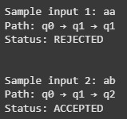

# otomata-coding-assignment-w4-235-268-275-292
otomata-coding-assignment-w4-235-268-275-292
# Tugas Minggu ke-4 Otomata
| Name           | NRP        | Kelas     |
| ---            | ---        | ----------|
| Algof Kristian Zega | 5025231235 | Otomata (E) |
| Gregorius Setiadharma | 5025231268 | Otomata (E) |
| Muhammad Davin Aulia Risky | 5025231275 | Otomata (E) |
| Muhammad Aditya Handrian | 5025231292 | Otomata (E) |

## Program Simulator DFA

> Implement DFA Simulator. Write explanation, how to use, example input and output

- Screenshot



- Source code 1 (input melalui code)
    ```py
    import json

    def run_dfa(dfa_data):
        states = dfa_data["states"]
        alphabet = dfa_data["alphabet"]
        start_state = dfa_data["start_state"]
        accept_states = dfa_data["accept_states"]
        transitions = dfa_data["transitions"]
        test_string = dfa_data["test_string"]
    
        current_state = start_state
        path = [current_state]
    
        for symbol in test_string:
            if symbol not in alphabet:
                print(f"Error: Symbol '{symbol}' not in DFA alphabet")
                return
            current_state = transitions[current_state][symbol]
            path.append(current_state)
    
        status = "ACCEPTED" if current_state in accept_states else "REJECTED"
        print("Path:", " → ".join(path))
        print("Status:", status)
    
    # Example DFA data (based on the image input format)
    # Sample input 1
    dfa_json = '''
    {
        "states": ["q0", "q1", "q2", "q3"],
        "alphabet": ["a", "b"],
        "start_state": "q0",
        "accept_states": ["q2", "q3"],
        "transitions": {
            "q0": { "a": "q1", "b": "q3" },
            "q1": { "a": "q1", "b": "q2" },
            "q2": { "a": "q1", "b": "q3" },
            "q3": { "a": "q2", "b": "q3" }
        },
        "test_string": "aa"
    }
    '''
    
    # Mencari jawaban sample input 1
    dfa_data = json.loads(dfa_json)
    print(f"Sample input 1: {dfa_data['test_string']}")
    run_dfa(dfa_data)
    print("\n")
    
    # Sample input 2
    dfa_json = '''
    {
        "states": ["q0", "q1", "q2", "q3"],
        "alphabet": ["a", "b"],
        "start_state": "q0",
        "accept_states": ["q2", "q3"],
        "transitions": {
            "q0": { "a": "q1", "b": "q3" },
            "q1": { "a": "q1", "b": "q2" },
            "q2": { "a": "q1", "b": "q3" },
            "q3": { "a": "q2", "b": "q3" }
        },
        "test_string": "ab"
    }
    '''
    
    # Mencari jawaban sample input 2
    dfa_data = json.loads(dfa_json)
    print(f"Sample input 2: {dfa_data['test_string']}")
    run_dfa(dfa_data)
    ```

Fungsi run_dfa(dfa_data) melakukan proses simulasi DFA. Langkah pertama adalah mengambil data dari dictionary. Variabel states, alphabet, start_state, accept_states, transitions, dan test_string digunakan untuk menyimpan informasi dari DFA yang akan diproses.

Selanjutnya, kita menginisialisasi state awal dengan cara current_state dimulai dari start_state. Setelah itu, kita menyimpan jejak state yang dilewati selama proses DFA dengan path.

Kemudian, kita memproses symbol pada test_string dengan loop untuk membaca setiap symbol dalam test_string. Jika symbol tidak ada dalam alphabet, maka akan menampilkan pesan error dan keluar dari fungsi. Jika symbol valid, maka akan terjadi transisi ke state berikutnya sesuai aturan transition. Tak lupa, tambahkan state yang dilewati ke dalam path.

Kita juga perlu mengecek status akhir. Jika current_state setelah memproses seluruh test_string ada di accept_states, maka statusnya ACCEPTED. Jika tidak, maka REJECTED. Kita juga menampilkan jalur state yang dilewati.

- Kelebihan:
Mudah dibaca dan dipahami.
Program terstruktur secara berurutan dari atas ke bawah.

- Kekurangan:
Tidak modular karena input harus diubah langsung di dalam kode.
Kurang fleksibel jika ingin menguji banyak skenario DFA.

- Source code 2 (input melalui file)
  ```py
    import json
    
    def run_dfa(dfa_data):
        states = dfa_data["states"]
        alphabet = dfa_data["alphabet"]
        start_state = dfa_data["start_state"]
        accept_states = dfa_data["accept_states"]
        transitions = dfa_data["transitions"]
        test_string = dfa_data["test_string"]
    
        current_state = start_state
        path = [current_state]
    
        for symbol in test_string:
            if symbol not in alphabet:
                print(f"Error: Symbol '{symbol}' not in DFA alphabet")
                return
            current_state = transitions[current_state][symbol]
            path.append(current_state)
    
        status = "ACCEPTED" if current_state in accept_states else "REJECTED"
        print("Path:", " → ".join(path))
        print("Status:", status)
    
    file_path = "dfa_test.json"
    
    try:
        with open(file_path, "r") as file:
            dfa_data = json.load(file)  # Mencoba membaca JSON
            run_dfa(dfa_data)
    except FileNotFoundError:
        print(f"Error: File '{file_path}' tidak ditemukan.")
    except json.JSONDecodeError as e:
        print("Error: Format JSON tidak valid.")
  ```
fungsi run_dfa pada source code 2 pada dasarnya sama seperti pada souce code 1, perbedaan pada keduanya hanya terjadi pada format inputnya saja.

- Kelebihan:
Lebih modular karena cukup mengganti isi file input tanpa perlu mengubah kode program.

- Kekurangan:
File tambahan membuat jumlah file bertambah, sehingga bisa sulit dibaca dan dikelola.

- Source code 3 (menggunakan library DFA secara langsung)
  ```py
    from automata.fa.dfa import DFA
    import json
    
    json_string = '''
    {
        "states": ["q0", "q1", "q2", "q3"],
        "alphabet": ["a", "b"],
        "start_state": "q0",
        "accept_states": ["q2", "q3"],
        "transitions": {
            "q0": { "a": "q1", "b": "q3" },
            "q1": { "a": "q1", "b": "q2" },
            "q2": { "a": "q1", "b": "q3" },
            "q3": { "a": "q2", "b": "q3" }
        },
        "test_string": "ab"
    }
    '''
    
    data = json.loads(json_string)
    
    dfa = DFA(
        states=set(data["states"]),
        input_symbols=set(data["alphabet"]),
        transitions=data["transitions"],
        initial_state=data['start_state'],
        final_states=set(data["accept_states"])
    )
    
    print(dfa.accepts_input(data['test_string']))  # True
    print(dfa.accepts_input('aa'))  # False
  ```
- Kelebihan:
Tidak perlu menulis fungsi DFA secara manual, karena sudah tersedia dalam library.

- Kekurangan:
Tidak dapat menampilkan jalur (path) yang dilalui, karena fitur ini tidak disediakan oleh library.

